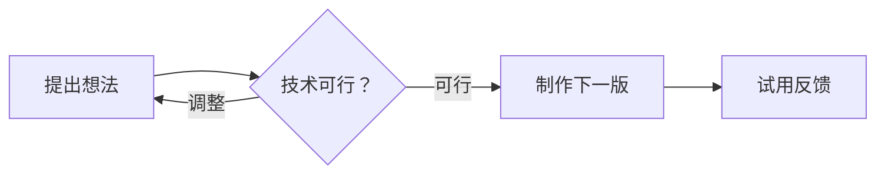
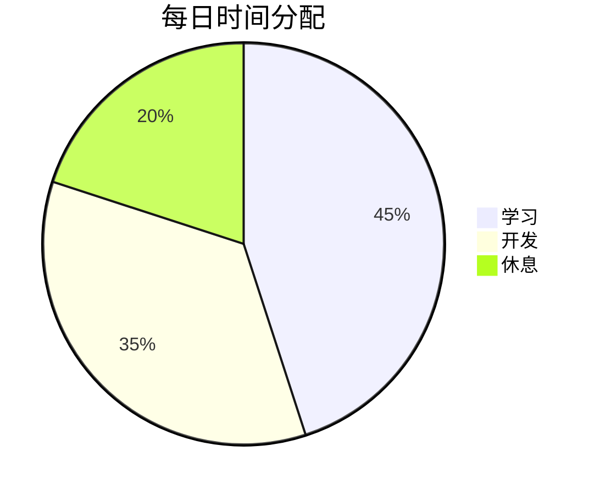
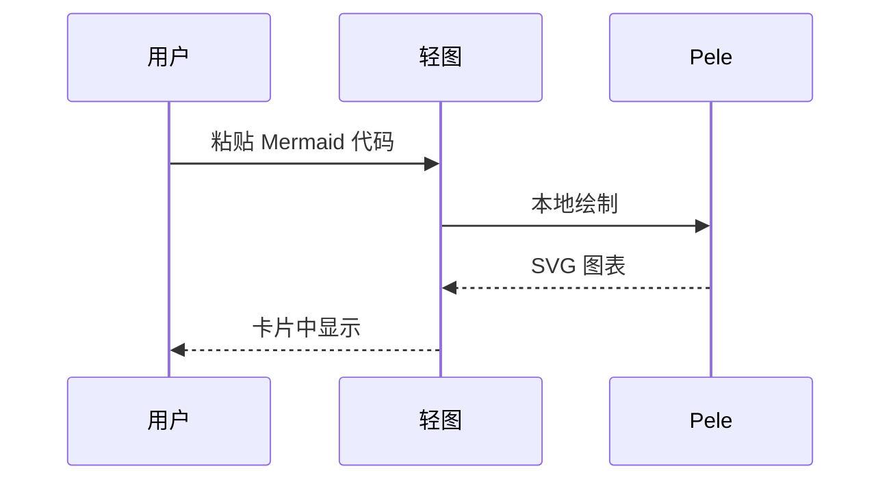
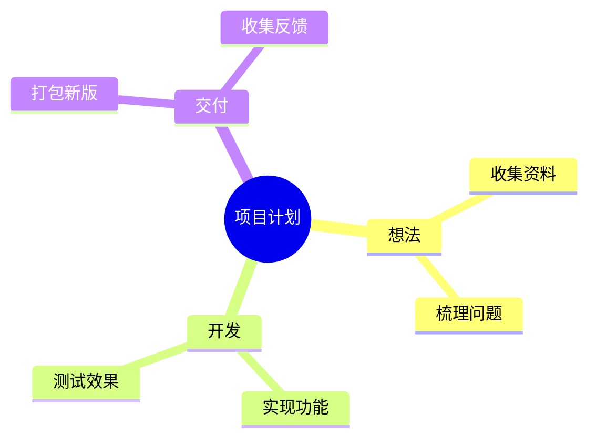
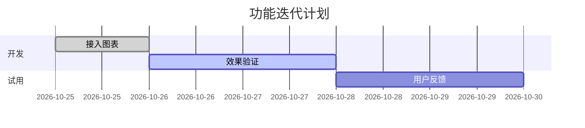

# Mermaid 图表示例

直接复制带围栏的代码粘贴到轻图正文；也可新建代码块并选择 Mermaid 图表。

## 流程图

```mermaid
flowchart LR
 A[提出想法] --> B{技术可行？}
 B -->|可行| C[制作下一版]
 B -->|调整| A
 C --> D[试用反馈]
```

## 饼图

```mermaid
pie title 每日时间分配
 "学习" : 45
 "开发" : 35
 "休息" : 20
```

## 时序图

```mermaid
sequenceDiagram
 participant U as 用户
 participant M as 轻图
 participant P as Pele
 U->>M: 粘贴 Mermaid 代码
 M->>P: 本地绘制
 P-->>M: SVG 图表
 M-->>U: 卡片中显示
```

## 思维导图

```mermaid
mindmap
 root((项目计划))
  想法
   收集资料
   梳理问题
  开发
   实现功能
   测试效果
  交付
   打包新版
   收集反馈
```

## 甘特图

```mermaid
gantt
 title 功能迭代计划
 dateFormat YYYY-MM-DD
 section 开发
 接入图表 :done, a, 2026-10-25, 1d
 效果验证 :active, b, after a, 2d
 section 试用
 用户反馈 :c, after b, 2d
```
